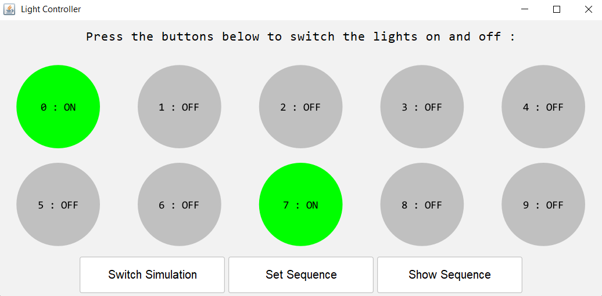

# Building Lighting Controller Application

## Project Description

This project is a Building Lighting Controller application that simulates the control of lights in a room. The application features a graphical user interface (GUI) consisting of circular buttons representing individual lighting points. Users can interact with the GUI to turn the lights on or off by pressing the corresponding buttons. Additionally, the application includes functionality to set a sequence of lighting actions and control the simulation of the lighting behavior.

The application incorporates an agent that supports Java Management Extensions (JMX). This agent allows users to remotely manipulate the lighting sequence, activate or deactivate specific lighting sources, and start or stop the simulation. The agent generates notifications whenever a lighting point is switched on or off, triggered by user interaction or the agent itself. These notifications provide real-time updates on the status of the lighting points, simulation switches, and sequence changes.

**Key features of the Building Lighting Controller Application:**

- GUI with circular buttons representing lighting points
- Ability to switch individual lights on or off by pressing the corresponding buttons
- Functionality to set a sequence of lighting actions
- Control to start or stop the simulation of lighting behavior
- JMX agent for remote management of lighting actions and generating real-time notifications

To use the application, you can run it and connect to it using JMX or a JConsole tool. This enables you to remotely control the lighting simulation, monitor the lighting actions, and receive notifications for status and sequence changes through the capabilities provided by the JMX agent.

*Graphical User Interface of the app*

## Usage
1. Launch the application by running the `Main.java` class in the `controller` package.
   - Ensure that you set the following JVM options when running the application:
     - `-Dcom.sun.management.jmxremote`
     - `-Dcom.sun.management.jmxremote.port=8008`
     - `-Dcom.sun.management.jmxremote.authenticate=false`
     - `-Dcom.sun.management.jmxremote.ssl=false`
   - These options enable JMX remote access without authentication or SSL.
2. The application will start and display a graphical user interface (GUI) consisting of circular buttons representing lighting points.
3. Interact with the GUI by clicking on the circular buttons to switch the corresponding lights on or off.
4. Utilize the "Set Sequence" button to define a sequence of lighting actions.
5. Use the "Switch Simulation" button to start or stop the simulation of lighting behavior.
6. The JMX agent associated with the application will generate notifications in the following scenarios:
   - When a lighting point is turned on or off, triggered by user interaction or the agent's actions.
   - When the simulation status is switched (started or stopped).
   - When the lighting sequence is changed.
7. Connect to the application using JMX or JConsole, specifying the port `8008`, to remotely control the lighting simulation, monitor the lighting actions, and receive notifications for status and sequence changes.
